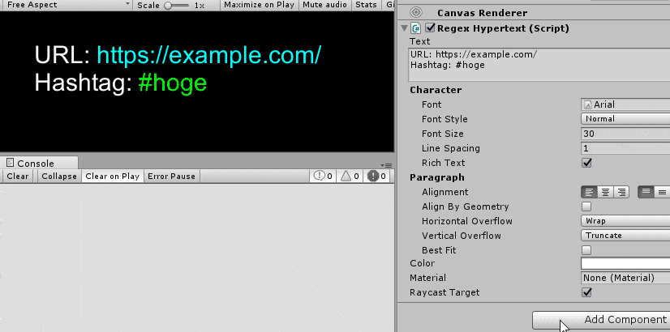

# uGUI-Hypertext [](https://github.com/setchi/uGUI-Hypertext/blob/master/LICENSE) [](https://github.com/setchi/uGUI-Hypertext/releases/latest)

`UnityEngine.UI.Text` で任意の部分文字列をクリック可能にするコンポーネントです。[English](https://translate.google.com/translate?sl=ja&tl=en&u=https://github.com/setchi/uGUI-Hypertext) (by Google Translate)



```csharp
public class RegexExample : MonoBehaviour
{
    [SerializeField] RegexHypertext text = default;

    const string RegexUrl = @"https?://(?:[!-~]+\.)+[!-~]+";
    const string RegexHashtag = @"[\s^][#＃]\w+";

    void Start()
    {
        text.OnClick(RegexUrl, Color.cyan, url => Debug.Log(url));
        text.OnClick(RegexHashtag, Color.green, hashtag => Debug.Log(hashtag));
    }
}
```

## 導入
[Releases](https://github.com/setchi/uGUI-Hypertext/releases/latest) から `Hypertext.unitypackage` をダウンロードして Unity Project にインポートします。

## サンプル
[Hypertext/Examples](Assets/Hypertext/Examples/) に正規表現によるパターンマッチで任意の部分文字列をクリック可能にする実装例があるので参考にしてください。

## 使い方
[HypertextBase](Assets/Hypertext/Scripts/HypertextBase.cs) を継承したクラスを作成し、`OnClick` メソッドを使って任意の部分文字列がクリックされた時のコールバックを登録できます。詳細はサンプルの [RegexHypertext](Assets/Hypertext/Examples/RegexHypertext.cs) を参考にしてください。

```csharp
/// <summary>
/// 指定した部分文字列にクリックイベントを登録します
/// </summary>
/// <param name="startIndex">部分文字列の開始文字位置</param>
/// <param name="length">部分文字列の長さ</param>
/// <param name="color">部分文字列につける色</param>
/// <param name="onClick">部分文字列がクリックされたときのコールバック</param>
protected void OnClick(int startIndex, int length, Color color, Action<string> onClick)
```

## 開発環境
Unity 2019.2.10f1

## Author
[setchi](https://github.com/setchi)

## License
[MIT](https://github.com/setchi/uGUI-Hypertext/blob/master/LICENSE)
